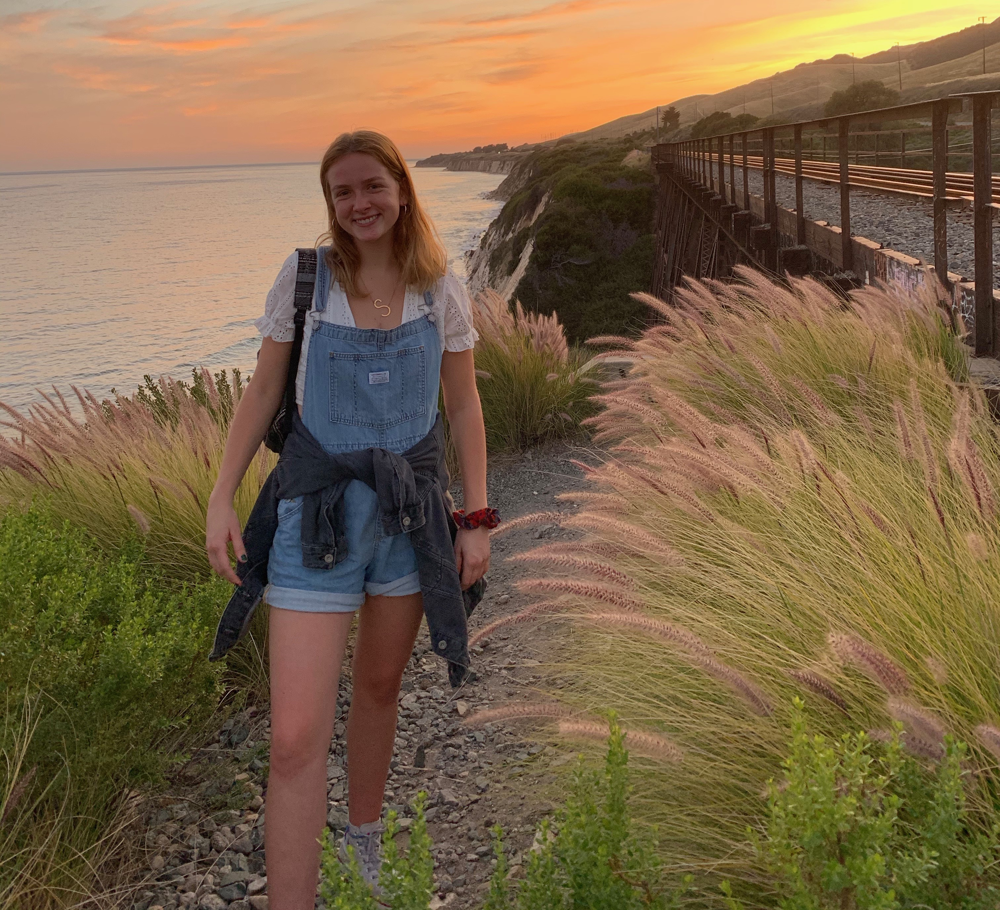

# Hello, I'm Shannon Sweeney.
_____
<i class="fa fa-smile-o fa-5x fa-spin" aria-hidden="true"></i>

<i class="fa fa-heart fa-5x fa-spin" aria-hidden="true"></i>

I am a student at UC Santa Barbara studying Environmental Studies and minoring in Geography, focusing on Space and Place. I am originally from a small town in the San Francisco Bay Area, Benicia. I currently work as the Chief of Staff for the Associated Students External Vice President of Local Affairs at UCSB. In this position I oversee all office projects and meetings. I enjoy running, cooking, going to the beach. Although I am not entirely sure what job field I plan to go into after college, I enjoy work that serves the community. 